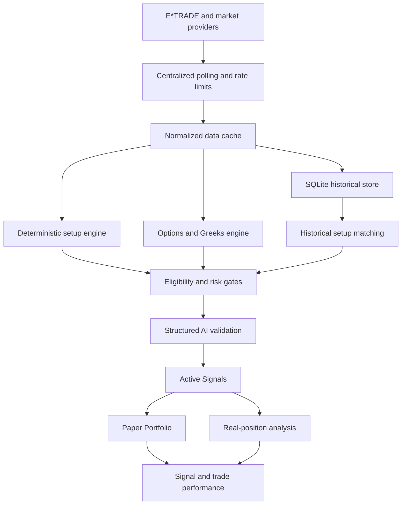

# Indicator Dashboard

**An AI-assisted options signal engine that turns market data into actionable setups, contract selections, position-management decisions, and measurable outcomes.**

Indicator Dashboard is evolving from a conventional indicator screen into a serious options signal platform. It scans a configured ticker universe, detects deterministic long and short setups, validates price structure with VWAP, volume, key levels, historical behavior, market context, and options quality, then publishes time-bounded signals with exact conditions.

It is built for active options traders, day traders, swing traders, quant-minded retail traders, market-data developers, and beta testers who want to inspect how a signal was created rather than accept a black-box label.

> **There is nothing good at the moment. I am still working.**
>
> No-trade output is a product feature. The engine is allowed to return no signal instead of lowering its standards to fill a list.

## Demo And Screens

The repository currently has no committed screenshots or hosted demo. Run the local stack to inspect the dashboard, ACTIVE SIGNALS, Morning Setup, Paper Portfolio, Trade Review, Watchlist Intelligence, and read-only E*TRADE Positions views.

~~~bash
cp .env.example .env
docker compose up -d --build
~~~

Open http://localhost:5173 after startup.

## Why This Exists

Most trading dashboards provide more data without providing a better decision surface. They often:

- overload charts with equal-weight indicators;
- leave stale setups visible after the trade is gone;
- confuse a good thesis with a good entry;
- promote the highest score even when every candidate is weak;
- ignore spread, liquidity, theta, IV, and contract structure;
- turn put/call activity into unsupported institutional claims;
- hide missing data behind zeros or generic confidence labels; and
- never measure whether a signal actually worked.

This project is designed to answer:

- What is actionable now?
- What exact price confirms the setup?
- Where is invalidation?
- Has the entry already been missed?
- Which option contract fits the setup?
- What is the maximum acceptable premium?
- What should happen during the next 15 minutes?
- When should a signal disappear?
- How often have comparable setups worked?
- How should an open position be managed?

## What It Does

- Scans a configured core universe on server-side schedules.
- Detects deterministic long and short setup families.
- Rejects chased, extended, stale, illiquid, or negative-risk/reward opportunities.
- Selects option contracts using DTE, strike, Greeks, IV, spread, volume, open interest, and expected value.
- Publishes exact entry, invalidation, target, premium, holding-window, and expiration conditions.
- Removes dead signals and preserves their history.
- Separates real E*TRADE records from paper activity.
- Stores reusable ticker intelligence and historical setup evidence.
- Supports structured OpenAI validation and advisory output.
- Allows no-trade output at every stage.

## ACTIVE SIGNALS

ACTIVE SIGNALS is the center of the platform. It contains only currently valid, actionable signals. A signal must originate from a deterministic setup classifier and pass price, VWAP, volume, level, reward-to-risk, contract, data-quality, and AI-validation gates.

Each signal can provide:

- ticker, direction, setup, state, and confidence;
- current underlying price;
- ideal entry and acceptable entry zone when available;
- maximum chase price;
- exact invalidation;
- Target 1 and Target 2;
- expected holding window and expiration;
- preferred contract, expiration, strike, and call/put type;
- last price, bid, ask, midpoint, and maximum acceptable premium;
- expected option values when cached estimates exist;
- historical result and sample size;
- VWAP, volume, key-level, freshness, and conflict fields; and
- one exact next action.

Example only; these are not live market values:

~~~text
NVDA — LONG — VWAP RECLAIM LONG — WAITING FOR RETEST

Preferred entry: Buy only after a pullback to $181.60–$181.90 holds above VWAP.
Breakout alternative: Completed 5-minute close above $183.10 with relative volume above 1.4.
Maximum chase: $183.45
Invalidation: Completed 5-minute close below $180.95.
Targets: $184.80 / $186.20
Preferred option: 21-DTE $182.50 call
Maximum acceptable premium: $6.10
Next action: Wait for pullback confirmation. Do not enter at current price.
~~~

### Signal Lifecycle

The persisted signal vocabulary includes:

~~~text
FORMING                    READY
TRIGGERED                  ACTIVE
WAITING FOR RETEST         WAITING FOR CONFIRMATION
EXTENDED                   DO NOT CHASE
EXPIRED                    INVALIDATED
TARGET REACHED             DATA STALE
REMOVED
~~~

Only READY, TRIGGERED, ACTIVE, WAITING FOR RETEST, and WAITING FOR CONFIRMATION appear in the active view. Extended, stale, rejected, invalidated, expired, completed, and removed signals move to Signal History with the reason and audit events.

The default short-term horizon is NEXT 15 MINUTES. The server evaluator runs every three minutes during the actionable monitoring window and every thirty minutes outside it. Closed sessions are planning mode and do not create new executable intraday signals.

### Best Long, Best Short, And Top Opportunities

The tab may show:

- Best Active Long Signal;
- Best Active Short Signal;
- Best 15-Minute Opportunity; and
- up to ten active signals.

These are maximums, not quotas. There is no forced long, forced short, forced top-ten list, or threshold reduction to populate the screen.

## Morning Trading Brief

The Morning Setup tab narrows the paper-trading universe before the open using:

- overnight market context;
- company, sector, and macro catalysts;
- premarket gaps and gap-versus-ATR behavior;
- same-time-of-day premarket relative volume;
- daily and premarket support/resistance;
- market and sector alignment;
- option availability and liquidity;
- opening breakout, pullback, failed-break, and no-trade scenarios; and
- maximum chase thresholds.

The current configuration uses 15-minute setup context and 5-minute opening confirmation. The workflow does not automatically enter at 9:30 AM. It waits for confirmation.

## Focused Chart Design

The default chart emphasizes:

1. VWAP
2. Volume
3. Key price levels

Default overlays include candlesticks, VWAP, volume, previous-day high and low, premarket high and low, opening range, support, resistance, entry, invalidation, targets, and trade markers. Advanced indicators remain available in ticker detail and drill-down views.

The backend still calculates and stores EMA, RSI, MACD, ATR, OBV, Chaikin Money Flow, Money Flow Index, Fibonacci levels, historical matches, relative strength, market regime, options positioning, Greeks, IV, news, social context, expected value, and contract quality.

## Deterministic Setup Engine

The deterministic engine establishes the facts. AI does not invent a setup.

The current signal vocabulary includes:

- VWAP reclaim long;
- VWAP rejection short;
- breakout long and breakdown short;
- bull flag and bear flag continuation;
- support-hold long and resistance-rejection short;
- failed breakout short and failed breakdown long;
- opening-range breakout and opening-range breakdown;
- pullback continuation;
- momentum continuation;
- relative-strength long and relative-weakness short; and
- reversal from a major level.

Detector coverage depends on profile completeness, candles, setup history, and provider data. Missing inputs exclude a ticker instead of becoming zero or neutral.

~~~text
Deterministic setup classifier
    -> exact entry / invalidation / targets
    -> grouped evidence and hard gates
    -> option contract and liquidity validation
    -> strict AI validation
    -> active signal publication or rejection
~~~

## Anti-Chase Logic

The platform separates a good thesis, a valid setup, a good entry, a missed trade, and an invalidated trade.

Signals can become WAITING FOR RETEST, EXTENDED, or DO NOT CHASE. A directionally correct idea can still be rejected when price has moved beyond the acceptable entry or remaining reward no longer justifies remaining risk.

> **Good thesis. Bad entry. No trade.**

## Options Contract Intelligence

The contract engine evaluates:

- expiration and DTE;
- strike and moneyness;
- delta, gamma, theta, vega, and IV;
- intrinsic and extrinsic value;
- bid, ask, midpoint, last, spread, volume, and open interest;
- expected value and reward-to-risk;
- value at invalidation and targets; and
- liquidity, stale-data, catalyst, and expiration gates.

Possible outputs are preferred contract, safer contract, higher-leverage contract, or no acceptable contract. Broker-provided Greeks are labeled as broker data. Locally calculated values are labeled as estimates.

## After-Hours Option Estimates

The option-estimation service preserves the last actual option quote or trade instead of replacing it with zero. It separately calculates theoretical current and next-open values when pricing inputs are available.

It can display last actual price, bid, ask, midpoint, baseline type, timestamps, estimated current value, estimated next-open value, IV scenarios, underlying scenarios, refreshed Greeks, model, and input quality.

The configured schedule is three minutes from 07:00 through 17:30 Eastern and thirty minutes outside that window. Estimates are labeled non-executable. They cannot trigger paper fills or trailing stops.

## Existing-Position Management

Real E*TRADE positions and paper positions are analyzed separately. Position analysis can include:

- original entry quality;
- current underlying and option value;
- current R and peak R;
- VWAP, volume, and management-timeframe structure;
- remaining reward versus remaining risk;
- profit giveback;
- theta and IV effects;
- overnight and catalyst risk; and
- exact next action.

Potential decisions include HOLD, TAKE PARTIAL, PROTECT PROFIT, MOVE STOP, HOLD RUNNER, DO NOT ADD, CLOSE, THESIS INVALIDATED, and DATA REFRESH REQUIRED.

## Exit Management

An approved paper setup must have an exit plan before entry. It can contain:

- initial stop and structural invalidation;
- 1R, Target 1, Target 2, and optional runner target;
- VWAP-loss condition;
- management-timeframe trend-break condition;
- time stop;
- end-of-day rule; and
- overnight eligibility.

The system tracks MFE, MAE, current R, peak R, realized R, profit captured, and profit surrendered. The configured paper portfolio models a 5% adverse fill assumption, a hybrid exit trail, and same-day loser handling.

These are simulation and analysis rules. The platform does not imply that a suggested stop was placed with E*TRADE.

## E*TRADE Integration

E*TRADE integration is implemented as an OAuth-backed, read-only brokerage-analysis path. It is account-dependent and requires the user’s own consumer credentials and authorization.

The repository supports brokerage facts such as:

- account list and balances;
- buying power;
- actual positions and quantities;
- average cost and market value;
- orders;
- fills; and
- transactions used by Trade Review.

The application polls and caches provider responses; it does not claim streaming market data. Top-of-book bid/ask data is not Level II, and Level II is not currently implemented. E*TRADE orders are not placed by this repository.

OAuth state and tokens are local runtime data, so connection status cannot be inferred from this public README. If the app displays E*TRADE DISCONNECTED, reconnect from Settings. The E*TRADE tab remains read-only.

## Real E*TRADE Versus Paper

This boundary is deliberate and enforced in the data model and routes.

**Real E*TRADE** contains actual brokerage accounts, balances, positions, cost basis, orders, fills, transactions, and real-trade review data.

**Paper Portfolio** contains simulated cash, positions, orders, fills, signal-driven entries, exit management, challenge performance, and paper recommendations.

Paper data never alters real account totals. Real positions never alter the paper balance. Simulated orders cannot reference brokerage order identifiers and never appear in E*TRADE views.

## Paper Portfolio

The paper portfolio is a signal-driven laboratory, not a claim of profitability. It supports the configured $100,000 starting balance, 75% maximum premium deployment, reserve cash, concentration controls, adverse fills, slippage, spread handling, trailing stops, same-day loser liquidation, overnight review, equity curve, P&L, drawdown, win rate, profit factor, and expectancy.

Opening paper trades require a valid TRIGGERED or ACTIVE signal, an acceptable premium, a complete exit plan, and portfolio-risk gates.

## Signal History And Performance

Signal History retains:

- signal ID, ticker, direction, and setup;
- created, trigger, expiration, validation, and removal timestamps;
- entry, invalidation, and target levels;
- selected contract and premium ceiling;
- whether it triggered;
- whether it entered paper trading;
- removal reason;
- MFE and MAE when recorded;
- target-before-invalidation result;
- option outcome when recorded; and
- model and strategy versions.

Untriggered signals are not counted as trade wins or losses. Signal quality can still be studied separately from paper performance.

The recommendation and paper-performance layers support all-time and rolling win rates, directional accuracy, target-before-invalidation rate, profitable-option rate, average win/loss, profit factor, expectancy, and breakdowns by setup, ticker, regime, calls/puts, DTE, delta, aggression, overnight status, and model version.

## AI Validation Architecture

~~~text
Market data
    -> centralized polling and cache
    -> normalized candles, quotes, options, news, and profiles
    -> deterministic calculations
    -> eligibility and risk gates
    -> strict structured AI validation
    -> Active Signals
    -> paper execution or real-position analysis
    -> outcome tracking
~~~

The AI layer may interpret and validate supplied facts. It may not invent setups, prices, Greeks, contracts, headlines, probabilities, account values, or institutional intent. It may not promote stale or illiquid contracts, override hard gates, or force a long or short signal.

The signal validator uses the OpenAI Responses API with structured output. If the API key is missing or validation fails, Active Signals fails closed. Deterministic analysis remains available for inspection.

## Persistent Ticker Intelligence

The configured core universe currently contains:

~~~text
AAPL  MSFT  NVDA  AMZN  GOOGL  META  TSLA
PLTR  SPCX  CRM   CAT   JPM   PANW  CRWD
~~~

Ticker profiles persist historical candles, indicators, Fibonacci interactions, setup families, market regimes, relative strength, news and earnings reactions, options snapshots, social aggregates, readiness states, and reusable statistics. Historical setup matching is configured for a three-year period where provider coverage and rate limits support it.

SPCX is preserved exactly as configured. The platform does not silently substitute another ticker if a provider cannot resolve it; the profile or contract remains unresolved/incomplete until supported.

## Data Honesty And Readiness

Every feature distinguishes among actual current data, delayed data, previous-session data, estimated data, historical data, stale data, missing data, and unsupported data.

Missing values are not converted to zero. Previous-session option values are not presented as live executable quotes. Profile readiness is feature-specific. A ticker cannot be READY while mandatory inputs are missing; it may instead be PARTIAL, ANALYSIS_PENDING, STALE, BLOCKED, or ERROR with the missing component shown.

## Architecture

### Actual Stack

- Backend: Python 3.11, FastAPI, Uvicorn, SQLAlchemy, pandas, NumPy, requests.
- Frontend: React 18, Vite, Tailwind CSS, Lightweight Charts, Recharts.
- Persistence: SQLite with SQLAlchemy models and incremental cached records.
- Runtime: separate Python backend and Nginx-served frontend containers through Docker Compose.
- Calendar: exchange-calendars with the XNYS calendar and America/New_York.
- Providers: E*TRADE, Yahoo/yfinance, Alpha Vantage, Finnhub, Stooq, and Twelve Data according to configuration.
- AI: OpenAI Responses API for structured validation and advisory workflows.

~~~text
indicator-dashboard/
├── backend/              FastAPI service, providers, analytics, workers, SQLite models
├── frontend/             React/Vite application and charts
├── config/config.yml     Session, provider, profile, signal, and risk settings
├── data/                 Local runtime database, OAuth tokens, caches; ignored by Git
├── sql/                  Retention and history helpers
└── docker-compose.yml    Local backend/frontend runtime
~~~

## Current Status

### Implemented

- ACTIVE SIGNALS UI, persisted signal lifecycle, active/history filtering, exact levels, expiration, chase removal, and paper-entry gating.
- Exchange-calendar session awareness and closed-session planning behavior.
- Focused 15-minute chart and position-analysis surfaces.
- Morning Setup workflow for paper-trading preparation.
- Paper Portfolio isolation, adverse-fill simulation, risk controls, exits, and performance tracking.
- E*TRADE OAuth path and read-only account, position, order, fill, and transaction analysis.
- Persistent ticker profiles, readiness states, historical setup matching, Fibonacci behavior, news/catalyst analysis, earnings history, money flow, options positioning, and social aggregation.
- Last-available option pricing and server-side theoretical after-hours estimation.
- Admin Trade Review for imported E*TRADE history.
- Backend tests covering market sessions, paper separation, option estimation, historical patterns, position review, and Active Signals.

### Partially Implemented Or Provider-Dependent

- Full three-year intraday coverage depends on provider limits, credentials, historical availability, and rate limits.
- Live option signals require connected E*TRADE data, complete profiles, fresh quotes, acceptable liquidity, and successful AI validation.
- OpenAI features depend on API key, model availability, latency, rate limits, and structured-response validation.
- Earnings, news, and some quote histories use configured providers with fallbacks; unavailable sources are shown as unavailable.
- Social processing exists, but no social source is enabled in config by default.

### Experimental Or Planned

- Live order routing is not implemented.
- Level II/order-book analysis is not implemented; top-of-book is not Level II.
- Broader cross-symbol calibration, richer option outcome attribution, and additional exit-method comparisons are being expanded.
- No hosted production environment or committed UI screenshots currently exists.

## Beta Testers Wanted

This is a useful-but-rough beta. The most valuable testers are traders and developers who can report:

- a signal that should have disappeared but remained visible;
- a setup that passed with stale or incomplete data;
- an option contract that should have failed liquidity or spread gates;
- a mismatch between broker data and displayed values;
- a paper trade that crossed the real/paper boundary;
- a historical result that appears to use future information; or
- a UI state that makes the next action unclear.

Include the tab, ticker, market session, timestamp, provider status, displayed state, and a sanitized reproduction. Never attach credentials, OAuth token files, account numbers, private IPs, or personal data.

## Roadmap

- Add committed product screenshots and a hosted beta environment.
- Expand deterministic setup families and setup-specific exit validation.
- Improve historical intraday coverage and provider reconciliation.
- Add calibrated walk-forward probabilities with stronger duplicate control.
- Expand option outcome attribution for IV, theta, spread, and slippage.
- Add authorized social connectors with documented rate limits.
- Add more UI and browser regression coverage.
- Evaluate optional broker execution only as a separate opt-in project with independent safety controls.

## Installation

### Prerequisites

- Docker and Docker Compose.
- Credentials for any provider you want to use.
- An E*TRADE developer application for real account/options data.
- An OpenAI API key for AI validation and advisory output.

### Start The Local Stack

~~~bash
cp .env.example .env
docker compose up -d --build
~~~

Default URLs:

- Frontend: http://localhost:5173
- Backend: http://localhost:8000
- API docs: http://localhost:8000/docs
- Health: http://localhost:8000/api/health

If BACKEND_PORT is set in .env, use that port for backend URLs and the E*TRADE callback.

### Useful Commands

~~~bash
docker compose logs -f backend
docker compose logs -f frontend
docker compose up -d --force-recreate backend
docker compose down
~~~

### Local Development Without Docker

The repository contains the actual service commands below. Install backend dependencies first and set writable local CONFIG_PATH and DATABASE_PATH values.

~~~bash
cd backend
uvicorn app.main:app --reload --host 0.0.0.0 --port 8000
~~~

In a second shell:

~~~bash
cd frontend
npm install
npm run dev
~~~

Build the frontend with:

~~~bash
npm run build
~~~

## Configuration

.env.example is the source of truth for environment variable names. It contains placeholders only. Never commit .env.

Common variables are:

~~~text
BACKEND_PORT
VITE_API_BASE_URL
DATABASE_PATH
CONFIG_PATH
ETRADE_CONSUMER_KEY
ETRADE_CONSUMER_SECRET
ETRADE_SANDBOX
ETRADE_CALLBACK_URL
TWELVEDATA_API_KEY
TWELVEDATA_BASE_URL
ALPHA_VANTAGE_API_KEY
FINNHUB_API_KEY
OPENAI_API_KEY
OPENAI_MODEL
OPENAI_ADVISORY_MODEL
OPENAI_ADVISORY_FALLBACK_MODEL
OPENAI_ADVISORY_REASONING_EFFORT
OPENAI_ADVISORY_MODE
OPENAI_MODEL_POSITION_ADVICE
OPENAI_MODEL_TRADE_REVIEW
AUTH_BOOTSTRAP_TOKEN
AUTH_INITIAL_PASSWORD
AUTH_PBKDF2_ITERATIONS
~~~

config/config.yml controls provider selection, session behavior, profile backfill, historical matching, options filters, signal cadence, option-estimation cadence, paper capital and exits, morning preparation, rate limits, and cache TTLs.

## Security

- .env and runtime .env.* files are ignored.
- data/* is ignored except data/.gitkeep.
- E*TRADE OAuth token files and provider caches remain under local runtime data.
- This README contains no credentials, keys, passwords, account identifiers, or private network values.
- Use strong local bootstrap and initial passwords.
- Do not expose the development server directly to the public internet without TLS, authentication, a reverse proxy, and a forwarded-client-IP policy.
- E*TRADE integration is read-only in this repository.
- Paper trades use separate entities and cannot update brokerage totals.

## API Surface

Representative authenticated routes include:

~~~text
GET    /api/signals/active
POST   /api/signals/refresh
POST   /api/signals/{signal_id}/trigger
GET    /api/signals/history
GET    /api/signals/status
POST   /api/signals/{signal_id}/outcome

GET    /api/etrade/accounts
GET    /api/etrade/positions
GET    /api/etrade/orders
GET    /api/etrade/trades

GET    /api/paper/portfolio
GET    /api/paper/positions
GET    /api/paper/orders
GET    /api/paper/recommendations
GET    /api/paper/performance
POST   /api/paper/orders

GET    /api/dashboard/decision
GET    /api/watchlist/intelligence
GET    /api/ticker-profiles/{symbol}
GET    /api/options/estimates
GET    /api/options/estimates/status
GET    /api/trade-review/overview
~~~

Authentication middleware protects application data routes. Health and market-session routes are public status routes. Provider, account, option-estimate, signal, paper, and review data require authentication, with additional admin restrictions where configured.

## Contributing

There is currently no separate CONTRIBUTING.md. Contributions are welcome through focused pull requests and issues.

Before opening a pull request:

1. Keep credentials, token files, databases, and personal data out of the change.
2. Preserve the real-versus-paper boundary.
3. Do not turn missing provider data into zero or fake confidence.
4. Add focused tests for lifecycle, provider, scoring, or UI behavior.
5. Run relevant backend tests and npm run build.
6. Describe provider, market-session, and incomplete-behavior assumptions.

A new signal must show how the deterministic classifier creates it, how hard gates reject it, how it expires or invalidates, and how the outcome is recorded. AI prompts must not invent facts or override deterministic gates.

## Project Principles

- No forced trade: the best output can be no signal.
- Exact levels over vague language: entry, invalidation, targets, and next action are concrete.
- Good setup is not automatically good entry: chase risk is a first-class gate.
- Options are instruments, not decoration: spread, liquidity, DTE, Greeks, IV, and theta matter.
- Data status is part of the answer: current, delayed, previous-session, estimated, stale, missing, and unsupported differ.
- Deterministic first, AI second: models explain and validate supplied facts; they do not create market facts.
- Real and paper stay separate: simulated performance never changes brokerage totals.
- History is auditable: later rule changes should not rewrite what the system originally published.
- Risk is managed before entry: every paper trade requires an exit plan.

## License And Project Identity

The repository currently does not contain a LICENSE file. Until one is added, do not assume the code is available under an open-source license. Check with the repository owner before redistributing or building commercial products from it.

The current project name is Indicator Dashboard. Stronger future product-name directions could include Signal Foundry, Option Vector, CandleToContract, or Active Signals, but changing the repository branding is deferred to avoid disrupting the current identity.

## Final Vision

The long-term goal is a serious, inspectable options platform:

~~~text
Market context
    -> setup detection
    -> exact entry
    -> contract selection
    -> signal validation
    -> disciplined paper execution
    -> position management
    -> historical outcome
    -> calibrated improvement
~~~

Not a wall of indicators. Not a forced trade list. Not an opaque AI oracle.

A platform that can say exactly what must happen, exactly what breaks the thesis, exactly what contract is being considered, and exactly when the setup is no longer actionable.

## Beta Invitation

Clone the repository, run it locally, inspect the signal audit trail, and open an issue with what held up and what did not. Traders, data engineers, quant developers, and careful skeptics are welcome.

Start with the local stack and remember the most honest result is sometimes:

> **There is nothing good at the moment. I am still working.**
